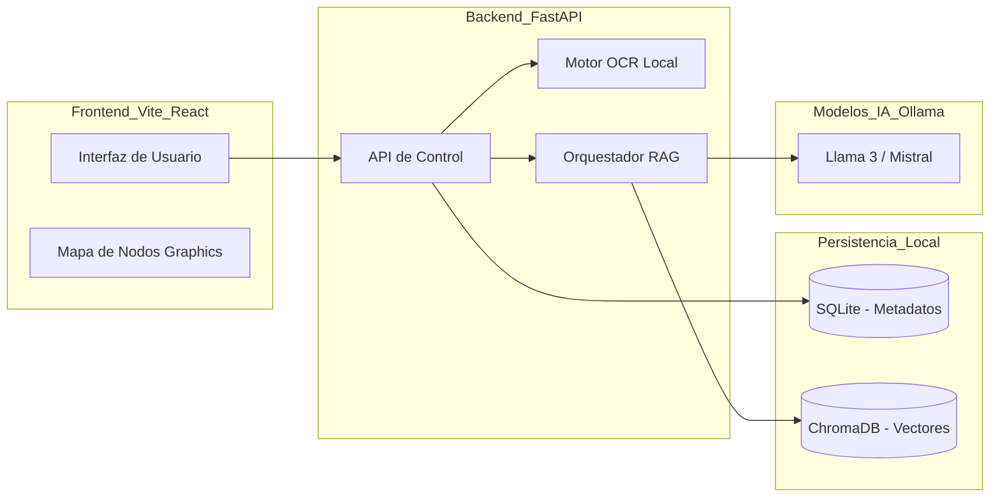

# Ingeniería de Software: Modelo de Datos y Arquitectura

Este documento describe la estructura interna del sistema **HMO Auditor** para asegurar su estabilidad, escalabilidad y facilidad de mantenimiento técnico.

## 1. Arquitectura del Sistema (Diagrama de Componentes)

## 2. Modelo de Datos (Esquema de Base de Datos - SQLite)

Para la trazabilidad (Audit Trail) e integridad (SHA-256), se utiliza una base de datos relacional junto a la vectorial:

### Tabla: `companies` (Empresas)
- `id`: PK (UUID)
- `name`: Nombre de la organización.
- `nit`: Identificación legal.
- `status`: [Simulación / Certificación].

### Tabla: `audit_logs` (Trazabilidad Humano-IA)
- `id`: PK
- `timestamp`: Fecha y hora de la acción.
- `user_role`: [Director / Auxiliar].
- `action`: [Carga / Edición / Aprobación].
- `content_before`: Texto sugerido por la IA.
- `content_after`: Texto validado por el humano.
- `norm_reference`: Cláusula ISO vinculada.

### Tabla: `documents_issued` (Integridad SHA-256)
- `id`: PK
- `file_name`: Nombre del documento generado.
- `generation_date`: Fecha.
- `sha256_hash`: Huella digital del archivo.
- `is_verified`: Boolean.

## 3. Arquitectura del RAG (ChromaDB)
El sistema utiliza dos colecciones vectoriales paralelas:
1. **Colección `Normas`**: Contenido estático indexado de las normas ISO/IFAC.
2. **Colección `Contexto`**: Contenido dinámico ingerido de la empresa tras la validación HITL.

*El cruce de estas dos colecciones mediante consultas de similitud es lo que permite el auto-diligenciamiento inteligente de los formatos.*
