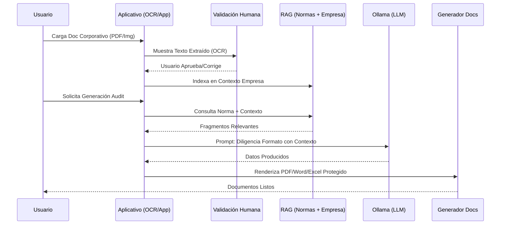

# Plan de Implementación: HMO Auditor Local (RAG-Audit)

Este documento detalla la estrategia técnica para construir una aplicación de auditoría que opera 100% en local, utilizando Ollama para el procesamiento de lenguaje natural y una arquitectura RAG para el cumplimiento normativo.

## User Review Required

> [!IMPORTANT]
> El sistema requiere que el hardware tenga capacidad suficiente para ejecutar Ollama (mínimo 8GB RAM para modelos 7B).
> La protección de documentos PDF, Word y Excel impedirá cambios estructurales pero permitirá el llenado de campos específicos (formularios).
> 3. **Auto-Diligenciamiento Inteligente**: Cruce de información entre la norma y los documentos de la empresa para pre-llenar campos de texto.
> 4. **Flujo de Validación Humana**: Interfaz para que el usuario acepte, edite o rechace lo sugerido por la AI antes de la generación final del documento protegido.

## Arquitectura Técnica

### Gestión de Entornos (Lógica de Arranque)
El sistema permitirá al usuario elegir entre dos modos de trabajo:
- **Modo Simulación**: Carga el perfil de `Innovatech Solutions SAS` pre-configurado para entrenamiento.
- **Modo Certificación**: Crea un espacio de trabajo limpio donde se aplica el **Checklist ISO de Ingesta** para una nueva empresa.

### Componentes Core
1. **Interfaz de Usuario**: Aplicación Desktop (Electron/Vite) o Web Local (FastAPI + React). Incluye **Motor de Grafos para Visualización de Nodos** (ej: React Flow o D3.js).
2. **Motor LLM**: Ollama ejecutando Llama 3 o Mistral 7B.
3. **Motor RAG Híbrido**: 
   - **Knowledge Base A (Biblioteca Normativa Multi-Sistemas)**: 
       - **SGC**: ISO 9001 (Calidad).
       - **SGSI**: ISO 27001 (Seguridad).
       - **SGA**: ISO 14001 (Ambiental).
       - **Académico**: Normas institucionales, Decretos sectoriales (ej: Dec. 1330), Modelos de Acreditación.
       - **Carga de Normas**: El sistema permite inyectar cualquier PDF normativo para entrenar al RAG.
   - **Knowledge Base B (Contexto Organizacional)**: Almacena Misión, Visión, Organigrama, Políticas y procesos internos.
   - **Pipeline de Ingesta (OCR)**: Integración con `Tesseract OCR` o `PaddleOCR` (ejecución local) para digitalizar documentos escaneados o imágenes corporativas.
   - **Embeddings**: Sentence-Transformers ejecutado en local.
   - **Vector Store**: ChromaDB con colecciones separadas.
4. **Capa de Integridad y Validación**:
   - **Módulo de Trazabilidad**: Database SQL local (SQLite) para registrar cada interacción Humano-AI (Log de cambios).
   - **Módulo de Firmas Digitales/Hashing**: Generación de Checksums SHA-256 por cada documento emitido.
   - **Agente de Verificación Cruzada**: Una instancia secundaria de Ollama para el control de calidad (Compliance Scoring).

### Estrategia RAG e Ingesta
- **Digitalización (OCR)**: Conversión de imágenes/PDFs escaneados a texto estructurado operando localmente.
- **Validación Humana y Entrada Manual (HITL)**: 
    - **Reconocimiento**: El usuario confirma el texto extraído.
    - **Inclusión Manual**: Si el sistema omite datos críticos por baja resolución o formato complejo, el usuario dispone de un **formulario de entrada manual** para añadir metadatos, cláusulas o políticas que la IA ignoró.
    - **Autorización Final**: Solo lo validado y/o escrito por el humano entra al motor RAG.
- **Chunking**: Fragmentación semántica con metadatos de origen.
- **Recuperación**: Búsqueda por similitud de coseno.

---

## Diseño de Salida Protegida

### PDF (Formularios AcroForms)
- **Tecnología**: `ReportLab` o `PyFPDF`.
- **Protección**: Uso de permisos estándar de PDF (Standard Security Handler) para deshabilitar edición de contenido y permitir solo "Form Filling".

### Word (.docx)
- **Tecnología**: `python-docx`.
- **Protección**: Inserción de *Content Controls* (SDTs) en áreas editables. Aplicación de `document protection` con tipo `wdAllowOnlyFormFields`.

### Excel (.xlsx)
- **Tecnología**: `openpyxl`.
- **Protección**: Bloqueo de todas las celdas por defecto. Desbloqueo de celdas específicas para entrada de datos. Aplicación de `SheetProtection` con contraseña (fija o configurable).

---

## Flujo de Información (Ejemplo)

---

## Metodología de Auditoría (HMO-Method)

El sistema seguirá el ciclo PHVA (Planear, Hacer, Verificar, Actuar) basado en la **ISO 19011:2018**:

1. **Planificación Automatizada**: Generación del Programa y Plan de Auditoría basados en el alcance definido por el usuario.
2. **Ejecución Asistida**: Listas de verificación dinámicas que incluyen el "Debería" de la norma recuperado por RAG.
3. **Hallazgos y Evidencias**: Formatos vinculados directamente a los criterios normativos para asegurar trazabilidad.
4. **Cierre y Reporte**: Consolidación automática para auditorías externas.

---

## Plan de Desarrollo (Roadmap)

### Fase 1: MVP y Refinamiento Profesional (ISO 9001)
- **Desarrollo**: Setup de Ollama + Interfaz de Ingesta (OCR/Manual).
- **Justificación ISO 9001 Cl. 7.5**: Control y digitalización de información documentada.
- **Implementación**: RAG para ISO 9001 y Contexto Empresa.
- **Salida**: Generador de Excel/Word protegidos con Hash SHA-256 (Integridad ISO 27001).
- **Demo**: Suite Innovatech en formatos reales para validación comercial.

### Fase 2: Despliegue en Nube y Organización Corporativa
- **Despliegue**: Integración con **Streamlit Community Cloud** vía GitHub.
- **Estructura de Almacenamiento**:
    - Directorio Raíz: `Auditorias_HMO/`
    - Subcarpeta por Empresa: `[Nombre_Empresa]/`
    - Organización Interna:
        - `01_Templates_Vacios/`: Formatos listos para inspección manual.
        - `02_Auditoria_Diligenciada/`: Formatos procesados con RAG y validación IA.
- **Generación Dual**: Botones separados para crear la plantilla vacía o ejecutar el motor de auto-llenado.
- **Git History**: Reconstrucción de un historial realista para mostrar la evolución del proyecto en GitHub.

### 5. Veracidad y Root of Trust Normativo
El sistema garantiza la veracidad mediante el **Anclaje Estricto a Documentos Oficiales**:
- **Cero Alucinación**: El RAG prioriza los fragmentos de los PDFs normativos cargados sobre el conocimiento general del LLM.
- **Cita Obligatoria**: Todo hallazgo o sugerencia debe venir acompañado del numeral o artículo correspondiente (ej: ISO 9001 Cl. 7.1.2 o Dec. 1330 Art. 2.5).
- **Control de Versiones**: Soporte específico para las versiones 2015/2022 de ISO para evitar anacronismos legales.
